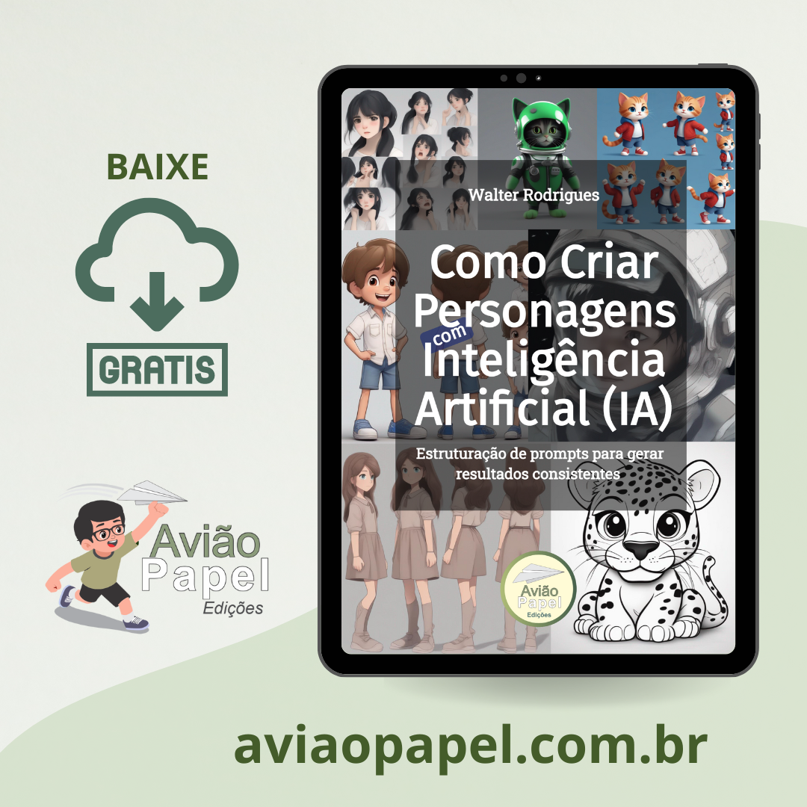

    

-------

# Projeto E-BOOK Gerado com Auxílio de I.A.s

 > ℹ️ **NOTE:** Este é o repositório desenvolvido durante o curso na plataforma da [DIO](https://dio.me)

Projeto com o objetivo de gerar um ebook digital com as facilidades das ferramentas de IA. A seguir alguns prompts
utilizados para auxiliar na criação desse e-book.

<a href="././output/ebook_como_criar_personagens_por_ia_v2.pdf" title="View PDF now"> 📕 Acessar E-book Agora!</a>

## 💻 Tecnologias utilizadas no projeto

- [ChatGPT](https://chat.openai.com/) 
- [Stable Diffusion](https://stability.ai/stable-image)
- [Microsoft Word](https://www.microsoft.com/en/microsoft-365/)
- [Avião Papel - Editor de Livros Infantis Online](https://aviaopapel.com.br/)

## 🧠 Prompts

ChatGPT：

|   Ação   | alguns prompt usados |
| :------: | ------------------------------------------------------------------------------------------------------------------------------------------------------------------------------------------------------------------------------------------------------------------------------ |
|  título  | Crie ideias de títulos para um livro digital que fale sobre inteligência artificial voltadas para criação de imagens de personagens para livros literários.                                                         |
| conteúdo | A partir do conteúdo a seguir faça as melhorias necessárias em cada trecho que estarei colando a seguir para que esteja de acordo com as normas gramaticais e coerente com os assuntos tratados. Fique a vontade para complementar informações que julgar pertinentes ao assunto, bem como sugerir correções ou atualizações no conteúdo |

Stable Diffusion：

|  Ação  | alguns prompts utilizados para criação de capa     |
| :----: | -------------------------------------------------------------------------------------- |
| imagens de capa | cute cat character, character sheet, multiple poses and expressions, children's book illustration style, blue sneakers, red jacket --no outline --ar 16:9  |
| imagem de capa | a girl, black hair, face expression sheet, white background, multiple emotions, 8k, ultra detailed --no outline --ar 16:9 |
| imagem de capa |  a boy in the [aqui você escreve o local, exempplo: space], no physical deformities, stylize 2500, quality 1.5, chaos 4, Unreal Engine, DSLR::1, uplight, 8k |
| imagem de capa | fashion girl, red hair, cartoon style, reference sheet, full body, character model, ultra detailed, 8k  |
| imagem de capa | Cute astronaut cat, concept art, green and black outfits, 3d blender render, 8k  |
| imagem de capa | A cute jaguar, disney pixar style style, white background, coloring line art, drawings for kids, cool coloring pages, coloring book art, coloring book page style vector lines, 8k |

## ✨ Features

- Pesquisa de conteúdo via ChatGPT
- Imagens geradas via Stable Diffusion
- Diagramação do miolo do livro no Microsoft Word
- Criação de layout de capa no CorelDRAW

## 📚 Materiais

- ebook criado e publicado disponível na pasta `output` 

## 🛠️ Instruções de execução

Consulte o ebook para conhecer diversos prompts e dicas de estruturação de prompts para criação de personagens por IA. Utilize os prompts acima nas ferramentas sugeridas para gerar o material base e utilize uma ferramenta de edição de documentos como power point, libreoffice , indesign para diagramação. 

## 👨‍💻 Expert

   

    Walter Rodrigues
    <a href="https://github.com/wljrodrigues"> | Meu GitHub</a> 

